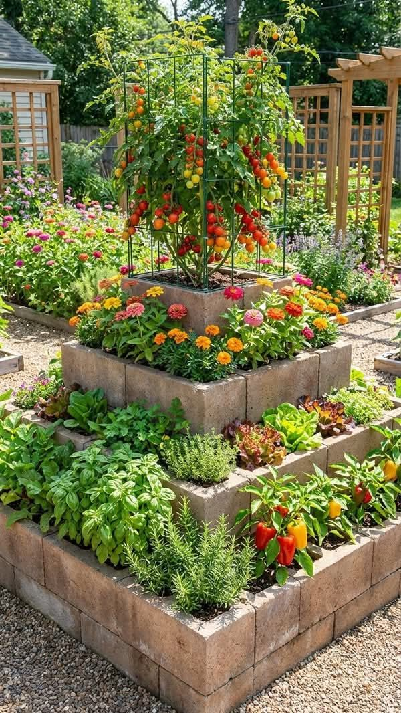
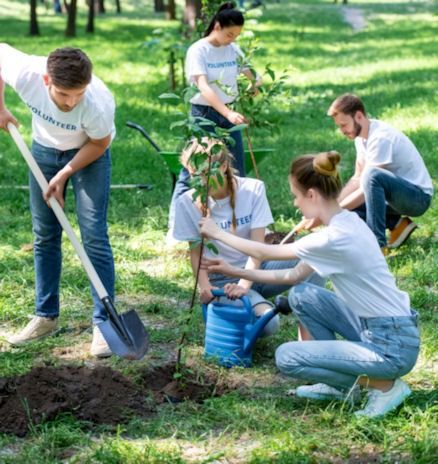
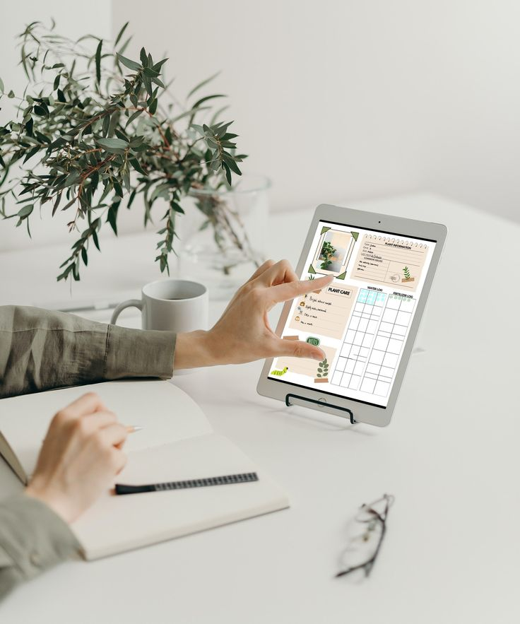
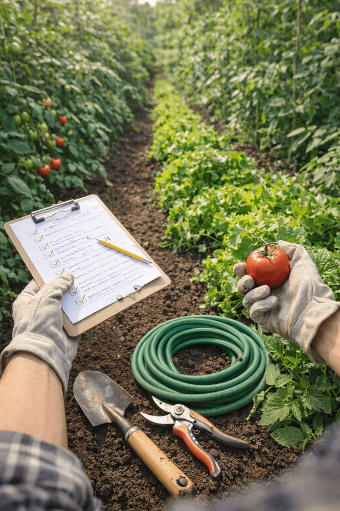
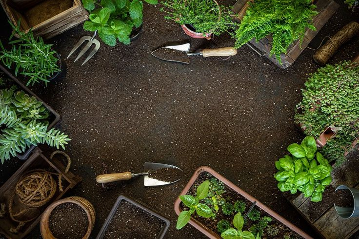
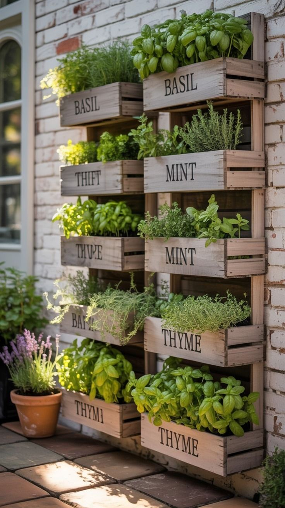
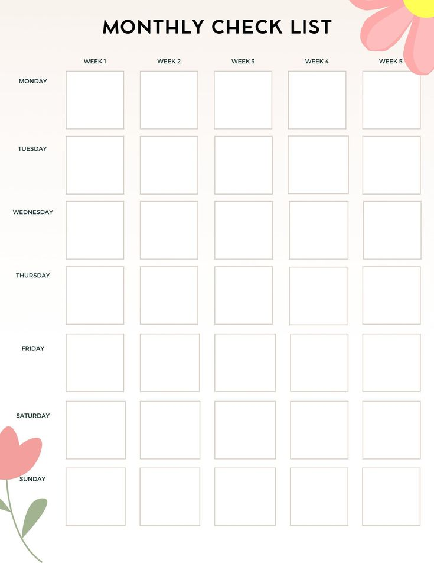
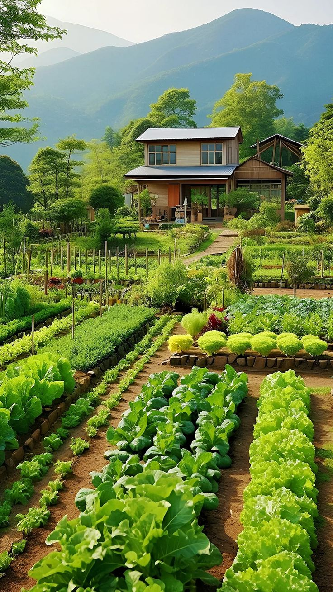
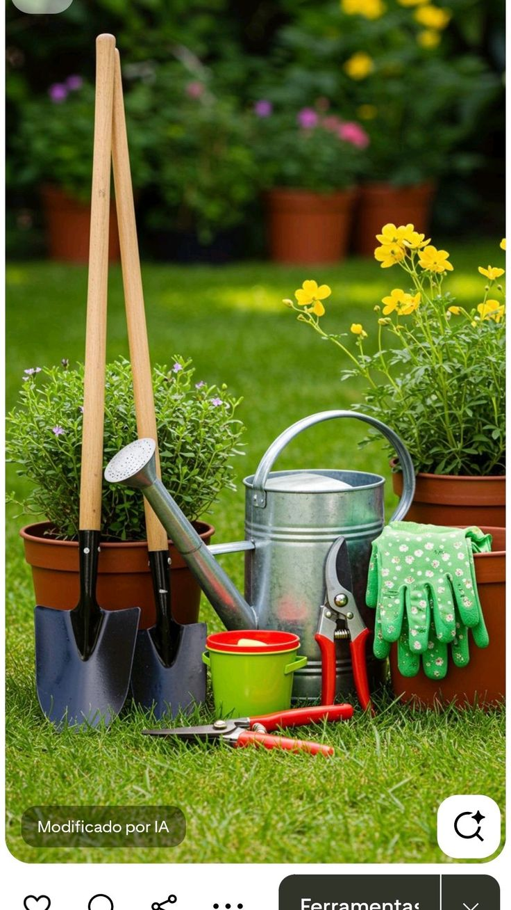
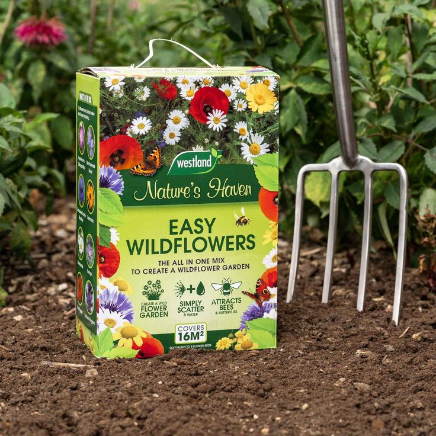

<!DOCTYPE html>
<html lang="en">
<head>
  <meta charset="UTF-8">
  <title>Gardens | Home</title>
  <meta name="viewport" content="width=device-width, initial-scale=1.0">
  <link rel="stylesheet" href="style.css">
</head>

<body>

<a class="skip-link" href="#main-content">Skip to main content</a>

<header>
  <h1>Gardens</h1>
  <nav aria-label="Main navigation">
    <a href="#home">Home</a>
    <a href="#services">Services</a>
    <a href="#activities">Activities</a>
    <a href="#about">About</a>
    <a href="boxes.html">Boxes</a>
    <a href="contact.html">Contact</a>
  </nav>
  <button id="theme-toggle" aria-pressed="false" aria-label="Toggle light/dark theme" style="background:none;border:none;color:inherit;cursor:pointer;font-size:18px;">🌙</button>
</header>

<main id="main-content">

<!-- HOME / HERO -->
<section id="home" class="hero">
  

    <h2>Sustainable Gardening Made Easy</h2>
    

      Gardens helps people grow healthy plants through expert advice,
      eco-friendly products and community activities.
    

  

</section>

<!-- SERVICES -->
<section id="services" class="content-section">
  <h2>Our Services</h2>

  

    <article class="service">
      <h3>Gardening Boxes</h3>
      

        Monthly boxes containing seeds, tools and eco-friendly gardening products.
      

        
    </article>

    <article class="service">
      <h3>Expert Advice Talks</h3>
      

        Online talks delivered by experienced gardeners and specialists.
      

        
    </article>

    <article class="service">
      <h3>Plant Diary</h3>
      

        Digital tools that help users track plant growth and gardening progress.
      

        
    </article>

    <article class="service">
      <h3>Seasonal Surveys</h3>
      

        Surveys that help improve services based on user feedback.
      

        
    </article>

  

</section>

<!-- ACTIVITIES -->
<section id="activities" class="content-section">
  <h2>Activities</h2>

  

    <figure>
      
      <figcaption>Open Gardens</figcaption>
    </figure>

    <figure>
      
      <figcaption>Monthly Gardening Checklist</figcaption>
    </figure>

    <figure>
      
      <figcaption>Greenhouse Tips</figcaption>
    </figure>

    <figure>
      
      <figcaption>Garden Maintenance</figcaption>
    </figure>

  

</section>

<!-- ABOUT -->
<section id="about" class="content-section">
  <h2>About Gardens</h2>

  

    Gardens is an online gardening company operating across Europe, Asia and
    New Zealand. The company focuses on sustainability, education and community
    engagement.
  

  

    

      <h3>Our Mission</h3>
      

        To make sustainable gardening accessible to everyone through expert guidance,
        digital tools and eco-friendly products.
      

      

      <h3>Our Values</h3>
      <ul>
        <li>Sustainability and environmental responsibility</li>
        <li>Education and skill development</li>
        <li>Accessibility and inclusion</li>
        <li>Community engagement</li>
      </ul>
    

    

      
    

  

  <h3>Our Mission</h3>
  

    To make sustainable gardening accessible to everyone through expert guidance,
    digital tools and eco-friendly products.
  

  <h3>Our Values</h3>
  <ul>
    <li>Sustainability and environmental responsibility</li>
    <li>Education and skill development</li>
    <li>Accessibility and inclusion</li>
    <li>Community engagement</li>
  </ul>
</section>

<!-- BOXES (summary on home) -->
<section id="boxes" class="content-section">
  <h2>Boxes</h2>
  
Explore our curated boxes — seeds, tools and seasonal collections.

  

    <article class="box monthly">
      <h3>Oddbox</h3>
      
Weekly wonky vegetables, seeds and blog access.

      
      
<a href="boxes.html">See all boxes</a>

    </article>

    <article class="box seasonal">
      <h3>Flourish</h3>
      
Four seasonal boxes with tools and accessories.

      
      
<a href="boxes.html">See all boxes</a>

    </article>

    <article class="box monthly">
      <h3>Cottage</h3>
      
Monthly wildflower seeds and fact cards.

      
      
<a href="boxes.html">See all boxes</a>

    </article>
  

</section>

<!-- CONTACT (simple form on home) -->
<section id="contact" class="content-section">
  <h2>Contact Us</h2>
  
If you have questions, send us a message.

  <form onsubmit="return validateForm()" aria-label="Contact form">
    <label for="email-home">Email address</label>
    <input type="email" id="email-home" required>

    <label for="message-home">Message</label>
    <textarea id="message-home" rows="5"></textarea>

    <button type="submit">Send Message</button>
  </form>
</section>

</main>

<footer class="site-footer">
  

    

      <h4>Gardens</h4>
      
Helping people grow healthy plants through expert advice, community events and eco-friendly products.

      

        <a href="https://twitter.com/" aria-label="Twitter" target="_blank" rel="noopener noreferrer">
          <svg viewBox="0 0 24 24" xmlns="http://www.w3.org/2000/svg" aria-hidden="true"><path d="M22 5.92c-.63.28-1.3.47-2 .56.72-.43 1.27-1.12 1.53-1.94-.68.4-1.43.68-2.23.84A3.5 3.5 0 0016.5 4c-1.93 0-3.5 1.76-3.5 3.93 0 .31.03.61.1.9-2.91-.15-5.49-1.66-7.22-3.95-.31.53-.49 1.12-.49 1.76 0 1.21.62 2.29 1.56 2.92-.58-.02-1.12-.18-1.59-.44v.04c0 1.7 1.23 3.12 2.86 3.44-.3.09-.63.14-.96.14-.23 0-.46-.02-.68-.07.47 1.47 1.82 2.54 3.42 2.57A7.03 7.03 0 014 19.54a9.9 9.9 0 005.36 1.57c6.43 0 9.95-5.8 9.95-10.83v-.49c.68-.5 1.27-1.13 1.74-1.85-.62.28-1.27.48-1.95.57z"/></svg>
        </a>
        <a href="https://instagram.com/" aria-label="Instagram" target="_blank" rel="noopener noreferrer">
          <svg viewBox="0 0 24 24" xmlns="http://www.w3.org/2000/svg" aria-hidden="true"><path d="M7 2h10a5 5 0 015 5v10a5 5 0 01-5 5H7a5 5 0 01-5-5V7a5 5 0 015-5zm5 5.9A4.1 4.1 0 1016.1 12 4.1 4.1 0 0012 7.9zM18.4 6.2a1.1 1.1 0 11-1.1-1.1 1.1 1.1 0 011.1 1.1z"/></svg>
        </a>
        <a href="https://facebook.com/" aria-label="Facebook" target="_blank" rel="noopener noreferrer">
          <svg viewBox="0 0 24 24" xmlns="http://www.w3.org/2000/svg" aria-hidden="true"><path d="M22 12a10 10 0 10-11.5 9.9v-7h-2.2v-2.9h2.2V9.1c0-2.2 1.3-3.4 3.2-3.4.93 0 1.9.17 1.9.17v2.1h-1.08c-1.07 0-1.4.66-1.4 1.34v1.6h2.4l-.38 2.9h-2.02v7A10 10 0 0022 12z"/></svg>
        </a>
      

    

    

      <h4>Navigation</h4>
      <ul>
        <li><a href="index.html">Home</a></li>
        <li><a href="services.html">Services</a></li>
        <li><a href="activities.html">Activities</a></li>
        <li><a href="boxes.html">Boxes</a></li>
        <li><a href="about.html">About</a></li>
        <li><a href="contact.html">Contact</a></li>
      </ul>
    

    

      <h4>Quick Links</h4>
      <ul>
        <li><a href="#services">Our Services</a></li>
        <li><a href="#activities">Activities</a></li>
        <li><a href="boxes.html">Buy Boxes</a></li>
        <li><a href="contact.html">Get Support</a></li>
      </ul>
    

    

      <h4>Contact Us</h4>
      
<strong>Phone:</strong> <a href="tel:+250798904567" style="color:#d8f0d8; text-decoration:none;">+250 798 904 567</a>

      
<strong>Email:</strong> <a href="mailto:bakhitaisimbi@gmail.com" style="color:#d8f0d8; text-decoration:none;">bakhitaisimbi@gmail.com</a>

      
<strong>Location:</strong> Kigali, Rwanda

    

  

  

    &copy; 2026 Gardens | Sustainable Gardening
  

</footer>

</body>
</html>

<!DOCTYPE html>
<html lang="en">
<head>
  <meta charset="UTF-8">
  <title>Gardens | Services</title>
  <meta name="viewport" content="width=device-width, initial-scale=1.0">
  <link rel="stylesheet" href="style.css">
</head>

<body>

<header>
  <h1>Gardens</h1>
  <nav aria-label="Main navigation">
    <a href="index.html">Home</a>
    <a href="services.html">Services</a>
    <a href="activities.html">Activities</a>
    <a href="boxes.html">Boxes</a>
    <a href="about.html">About</a>
    <a href="contact.html">Contact</a>
  </nav>
  <button id="theme-toggle" aria-pressed="false" aria-label="Toggle light/dark theme" style="background:none;border:none;color:inherit;cursor:pointer;font-size:18px;">🌙</button>
</header>

<a class="skip-link" href="#main-content">Skip to main content</a>
<main id="main-content">

<section class="page-intro">
  <h2>Our Services</h2>
  

    Gardens provides a range of services designed to support sustainable
    gardening for beginners and experienced gardeners.
  

</section>

<section class="service-grid">

  <article class="service">
    <h3>Gardening Boxes</h3>
    

      Our curated gardening boxes deliver seasonal seeds, tools and eco-friendly
      products directly to your home.
    

    
  </article>

  <article class="service">
    <h3>Online Advice Talks</h3>
    

      Live and recorded talks hosted by gardening experts covering seasonal
      planting and maintenance.
    

    
  </article>

  <article class="service">
    <h3>Plant Diary & Progress Notes</h3>
    

      Track plant growth and garden progress using our digital plant diary.
    

    
  </article>

  <article class="service">
    <h3>Seasonal Surveys</h3>
    

      Participate in surveys to help us improve services and tailor future
      gardening content.
    

    
  </article>

  <article class="service">
    <h3>Photography Competitions</h3>
    

      Share garden photos and take part in friendly community competitions.
    

  </article>

</section>

</main>

<footer class="site-footer">
  

    

      <h4>Gardens</h4>
      
Helping people grow healthy plants through expert advice, community events and eco-friendly products.

      

        <a href="https://twitter.com/" aria-label="Twitter" target="_blank" rel="noopener noreferrer">
          <svg viewBox="0 0 24 24" xmlns="http://www.w3.org/2000/svg" aria-hidden="true"><path d="M22 5.92c-.63.28-1.3.47-2 .56.72-.43 1.27-1.12 1.53-1.94-.68.4-1.43.68-2.23.84A3.5 3.5 0 0016.5 4c-1.93 0-3.5 1.76-3.5 3.93 0 .31.03.61.1.9-2.91-.15-5.49-1.66-7.22-3.95-.31.53-.49 1.12-.49 1.76 0 1.21.62 2.29 1.56 2.92-.58-.02-1.12-.18-1.59-.44v.04c0 1.7 1.23 3.12 2.86 3.44-.3.09-.63.14-.96.14-.23 0-.46-.02-.68-.07.47 1.47 1.82 2.54 3.42 2.57A7.03 7.03 0 014 19.54a9.9 9.9 0 005.36 1.57c6.43 0 9.95-5.8 9.95-10.83v-.49c.68-.5 1.27-1.13 1.74-1.85-.62.28-1.27.48-1.95.57z"/></svg>
        </a>
        <a href="https://instagram.com/" aria-label="Instagram" target="_blank" rel="noopener noreferrer">
          <svg viewBox="0 0 24 24" xmlns="http://www.w3.org/2000/svg" aria-hidden="true"><path d="M7 2h10a5 5 0 015 5v10a5 5 0 01-5 5H7a5 5 0 01-5-5V7a5 5 0 015-5zm5 5.9A4.1 4.1 0 1016.1 12 4.1 4.1 0 0012 7.9zM18.4 6.2a1.1 1.1 0 11-1.1-1.1 1.1 1.1 0 011.1 1.1z"/></svg>
        </a>
        <a href="https://facebook.com/" aria-label="Facebook" target="_blank" rel="noopener noreferrer">
          <svg viewBox="0 0 24 24" xmlns="http://www.w3.org/2000/svg" aria-hidden="true"><path d="M22 12a10 10 0 10-11.5 9.9v-7h-2.2v-2.9h2.2V9.1c0-2.2 1.3-3.4 3.2-3.4.93 0 1.9.17 1.9.17v2.1h-1.08c-1.07 0-1.4.66-1.4 1.34v1.6h2.4l-.38 2.9h-2.02v7A10 10 0 0022 12z"/></svg>
        </a>
      

    

    

      <h4>Navigation</h4>
      <ul>
        <li><a href="index.html">Home</a></li>
        <li><a href="services.html">Services</a></li>
        <li><a href="activities.html">Activities</a></li>
        <li><a href="boxes.html">Boxes</a></li>
        <li><a href="about.html">About</a></li>
        <li><a href="contact.html">Contact</a></li>
      </ul>
    

    

      <h4>Quick Links</h4>
      <ul>
        <li><a href="#services">Our Services</a></li>
        <li><a href="#activities">Activities</a></li>
        <li><a href="boxes.html">Buy Boxes</a></li>
        <li><a href="contact.html">Get Support</a></li>
      </ul>
    

    

      <h4>Contact Us</h4>
      
<strong>Phone:</strong> <a href="tel:+250798904567" style="color:#d8f0d8; text-decoration:none;">+250 798 904 567</a>

      
<strong>Email:</strong> <a href="mailto:bakhitaisimbi@gmail.com" style="color:#d8f0d8; text-decoration:none;">bakhitaisimbi@gmail.com</a>

      
<strong>Location:</strong> Kigali, Rwanda

    

  

  

    &copy; 2026 Gardens | Sustainable Gardening
  

</footer>

</body>
</html>

<!DOCTYPE html>
<html lang="en">
<head>
  <meta charset="UTF-8">
  <title>Gardens | Activities</title>
  <meta name="viewport" content="width=device-width, initial-scale=1.0">
  <link rel="stylesheet" href="style.css">
</head>

<body>

<header>
  <h1>Gardens</h1>
  <nav aria-label="Main navigation">
    <a href="index.html">Home</a>
    <a href="services.html">Services</a>
    <a href="activities.html">Activities</a>
    <a href="boxes.html">Boxes</a>
    <a href="about.html">About</a>
    <a href="contact.html">Contact</a>
  </nav>
  <button id="theme-toggle" aria-pressed="false" aria-label="Toggle light/dark theme" style="background:none;border:none;color:inherit;cursor:pointer;font-size:18px;">🌙</button>
</header>

<a class="skip-link" href="#main-content">Skip to main content</a>
<main id="main-content">

<section class="page-intro">
  <h2>Gardening Activities</h2>
  

    Gardens offers a range of activities designed to support both beginner
    and experienced gardeners throughout the year.
  

</section>

<section class="service-grid">

  <article class="service">
    
    <h3>Open Gardens</h3>
    

      Guided visits to inspiring gardens where members can learn practical
      techniques from experienced gardeners.
    

  </article>

  <article class="service">
    
    <h3>Monthly Gardening Checklists</h3>
    

      Step-by-step seasonal checklists that help users stay organised and
      maintain healthy gardens.
    

  </article>

  <article class="service">
    
    <h3>Greenhouse Tips</h3>
    

      Advice on temperature control, watering, and plant care for greenhouse
      environments.
    

  </article>

  <article class="service">
    
    <h3>Garden Maintenance Advice</h3>
    

      Practical guidance on pruning, soil care, pest control, and general
      garden upkeep.
    

  </article>

  <article class="service">
    
    <h3>Allotment Jobs</h3>
    

      Support and advice for managing allotments efficiently throughout
      different seasons.
    

  </article>

</section>

</main>

<footer class="site-footer">
  

    

      <h4>Gardens</h4>
      
Helping people grow healthy plants through expert advice, community events and eco-friendly products.

      

        <a href="https://twitter.com/" aria-label="Twitter" target="_blank" rel="noopener noreferrer">
          <svg viewBox="0 0 24 24" xmlns="http://www.w3.org/2000/svg" aria-hidden="true"><path d="M22 5.92c-.63.28-1.3.47-2 .56.72-.43 1.27-1.12 1.53-1.94-.68.4-1.43.68-2.23.84A3.5 3.5 0 0016.5 4c-1.93 0-3.5 1.76-3.5 3.93 0 .31.03.61.1.9-2.91-.15-5.49-1.66-7.22-3.95-.31.53-.49 1.12-.49 1.76 0 1.21.62 2.29 1.56 2.92-.58-.02-1.12-.18-1.59-.44v.04c0 1.7 1.23 3.12 2.86 3.44-.3.09-.63.14-.96.14-.23 0-.46-.02-.68-.07.47 1.47 1.82 2.54 3.42 2.57A7.03 7.03 0 014 19.54a9.9 9.9 0 005.36 1.57c6.43 0 9.95-5.8 9.95-10.83v-.49c.68-.5 1.27-1.13 1.74-1.85-.62.28-1.27.48-1.95.57z"/></svg>
        </a>
        <a href="https://instagram.com/" aria-label="Instagram" target="_blank" rel="noopener noreferrer">
          <svg viewBox="0 0 24 24" xmlns="http://www.w3.org/2000/svg" aria-hidden="true"><path d="M7 2h10a5 5 0 015 5v10a5 5 0 01-5 5H7a5 5 0 01-5-5V7a5 5 0 015-5zm5 5.9A4.1 4.1 0 1016.1 12 4.1 4.1 0 0012 7.9zM18.4 6.2a1.1 1.1 0 11-1.1-1.1 1.1 1.1 0 011.1 1.1z"/></svg>
        </a>
        <a href="https://facebook.com/" aria-label="Facebook" target="_blank" rel="noopener noreferrer">
          <svg viewBox="0 0 24 24" xmlns="http://www.w3.org/2000/svg" aria-hidden="true"><path d="M22 12a10 10 0 10-11.5 9.9v-7h-2.2v-2.9h2.2V9.1c0-2.2 1.3-3.4 3.2-3.4.93 0 1.9.17 1.9.17v2.1h-1.08c-1.07 0-1.4.66-1.4 1.34v1.6h2.4l-.38 2.9h-2.02v7A10 10 0 0022 12z"/></svg>
        </a>
      

    

    

      <h4>Navigation</h4>
      <ul>
        <li><a href="index.html">Home</a></li>
        <li><a href="services.html">Services</a></li>
        <li><a href="activities.html">Activities</a></li>
        <li><a href="boxes.html">Boxes</a></li>
        <li><a href="about.html">About</a></li>
        <li><a href="contact.html">Contact</a></li>
      </ul>
    

    

      <h4>Quick Links</h4>
      <ul>
        <li><a href="#services">Our Services</a></li>
        <li><a href="#activities">Activities</a></li>
        <li><a href="boxes.html">Buy Boxes</a></li>
        <li><a href="contact.html">Get Support</a></li>
      </ul>
    

    

      <h4>Contact Us</h4>
      
<strong>Phone:</strong> <a href="tel:+250798904567" style="color:#d8f0d8; text-decoration:none;">+250 798 904 567</a>

      
<strong>Email:</strong> <a href="mailto:bakhitaisimbi@gmail.com" style="color:#d8f0d8; text-decoration:none;">bakhitaisimbi@gmail.com</a>

      
<strong>Location:</strong> Kigali, Rwanda

    

  

  

    &copy; 2026 Gardens | Sustainable Gardening
  

</footer>

</body>
</html>

<!DOCTYPE html>
<html lang="en">
<head>
  <meta charset="UTF-8">
  <title>Gardens | About Us</title>
  <meta name="viewport" content="width=device-width, initial-scale=1.0">
  <link rel="stylesheet" href="style.css">
</head>

<body>

<header>
  <h1>Gardens</h1>
  <nav aria-label="Main navigation">
    <a href="index.html">Home</a>
    <a href="services.html">Services</a>
    <a href="activities.html">Activities</a>
    <a href="boxes.html">Boxes</a>
    <a href="about.html">About</a>
    <a href="contact.html">Contact</a>
  </nav>
  <button id="theme-toggle" aria-pressed="false" aria-label="Toggle light/dark theme" style="background:none;border:none;color:inherit;cursor:pointer;font-size:18px;">🌙</button>
</header>

<a class="skip-link" href="#main-content">Skip to main content</a>
<main id="main-content">

<section class="page-intro">
  <h2>About Gardens</h2>
  

    Gardens is an online gardening company operating across Europe, Asia and
    New Zealand. We focus on sustainability, education and community building.
  

</section>

<section class="about-content">

  <article>
    <h3>Our Mission</h3>
    

      Our mission is to make sustainable gardening accessible to everyone by
      providing practical tools, expert advice and eco-friendly products.
    

  </article>

  <article>
    <h3>Our Values</h3>
    <ul>
      <li>Sustainability and environmental responsibility</li>
      <li>Education and skill development</li>
      <li>Community and collaboration</li>
      <li>Accessibility and inclusion</li>
    </ul>
  </article>

  <article>
    <h3>Why Choose Gardens?</h3>
    

      We combine expert knowledge with simple, easy-to-use digital services,
      ensuring our website and products meet the needs of diverse users.
    

  </article>
  

</section>

</main>

<footer class="site-footer">
  

    

      <h4>Gardens</h4>
      
Helping people grow healthy plants through expert advice, community events and eco-friendly products.

      

        <a href="https://twitter.com/" aria-label="Twitter" target="_blank" rel="noopener noreferrer">
          <svg viewBox="0 0 24 24" xmlns="http://www.w3.org/2000/svg" aria-hidden="true"><path d="M22 5.92c-.63.28-1.3.47-2 .56.72-.43 1.27-1.12 1.53-1.94-.68.4-1.43.68-2.23.84A3.5 3.5 0 0016.5 4c-1.93 0-3.5 1.76-3.5 3.93 0 .31.03.61.1.9-2.91-.15-5.49-1.66-7.22-3.95-.31.53-.49 1.12-.49 1.76 0 1.21.62 2.29 1.56 2.92-.58-.02-1.12-.18-1.59-.44v.04c0 1.7 1.23 3.12 2.86 3.44-.3.09-.63.14-.96.14-.23 0-.46-.02-.68-.07.47 1.47 1.82 2.54 3.42 2.57A7.03 7.03 0 014 19.54a9.9 9.9 0 005.36 1.57c6.43 0 9.95-5.8 9.95-10.83v-.49c.68-.5 1.27-1.13 1.74-1.85-.62.28-1.27.48-1.95.57z"/></svg>
        </a>
        <a href="https://instagram.com/" aria-label="Instagram" target="_blank" rel="noopener noreferrer">
          <svg viewBox="0 0 24 24" xmlns="http://www.w3.org/2000/svg" aria-hidden="true"><path d="M7 2h10a5 5 0 015 5v10a5 5 0 01-5 5H7a5 5 0 01-5-5V7a5 5 0 015-5zm5 5.9A4.1 4.1 0 1016.1 12 4.1 4.1 0 0012 7.9zM18.4 6.2a1.1 1.1 0 11-1.1-1.1 1.1 1.1 0 011.1 1.1z"/></svg>
        </a>
        <a href="https://facebook.com/" aria-label="Facebook" target="_blank" rel="noopener noreferrer">
          <svg viewBox="0 0 24 24" xmlns="http://www.w3.org/2000/svg" aria-hidden="true"><path d="M22 12a10 10 0 10-11.5 9.9v-7h-2.2v-2.9h2.2V9.1c0-2.2 1.3-3.4 3.2-3.4.93 0 1.9.17 1.9.17v2.1h-1.08c-1.07 0-1.4.66-1.4 1.34v1.6h2.4l-.38 2.9h-2.02v7A10 10 0 0022 12z"/></svg>
        </a>
      

    

    

      <h4>Navigation</h4>
      <ul>
        <li><a href="index.html">Home</a></li>
        <li><a href="services.html">Services</a></li>
        <li><a href="activities.html">Activities</a></li>
        <li><a href="boxes.html">Boxes</a></li>
        <li><a href="about.html">About</a></li>
        <li><a href="contact.html">Contact</a></li>
      </ul>
    

    

      <h4>Quick Links</h4>
      <ul>
        <li><a href="#services">Our Services</a></li>
        <li><a href="#activities">Activities</a></li>
        <li><a href="boxes.html">Buy Boxes</a></li>
        <li><a href="contact.html">Get Support</a></li>
      </ul>
    

    

      <h4>Contact Us</h4>
      
<strong>Phone:</strong> <a href="tel:+250798904567" style="color:#d8f0d8; text-decoration:none;">+250 798 904 567</a>

      
<strong>Email:</strong> <a href="mailto:bakhitaisimbi@gmail.com" style="color:#d8f0d8; text-decoration:none;">bakhitaisimbi@gmail.com</a>

      
<strong>Location:</strong> Kigali, Rwanda

    

  

  

    &copy; 2026 Gardens | Sustainable Gardening
  

</footer>

</body>
</html>

<!DOCTYPE html>
<html lang="en">
<head>
  <meta charset="UTF-8">
  <title>Gardens | Boxes</title>
  <meta name="viewport" content="width=device-width, initial-scale=1.0">
  <link rel="stylesheet" href="style.css">
</head>

<body>

<header>
  <h1>Gardening Boxes</h1>
  <nav>
    <a href="index.html">Home</a>
    <a href="boxes.html">Boxes</a>
    <a href="contact.html">Contact</a>
  </nav>
  <button id="theme-toggle" aria-pressed="false" aria-label="Toggle light/dark theme" style="background:none;border:none;color:inherit;cursor:pointer;font-size:18px;">🌙</button>
</header>

<a class="skip-link" href="#main-content">Skip to main content</a>
<main id="main-content">

<section class="filters">
  <button onclick="filterBoxes('all')">All</button>
  <button onclick="filterBoxes('monthly')">Monthly</button>
  <button onclick="filterBoxes('seasonal')">Seasonal</button>
</section>

<section class="box-grid">

  <article class="box monthly">
    <h3>Oddbox</h3>
    
Weekly wonky vegetables, seeds and blog access.

    <button onclick="selectBox('Oddbox')">Select</button>
    
  </article>

  <article class="box seasonal">
    <h3>Flourish</h3>
    
Four seasonal boxes with tools and accessories.

    <button onclick="selectBox('Flourish')">Select</button>
    
  </article>

  <article class="box monthly">
    <h3>Cottage</h3>
    
Monthly wildflower seeds and fact cards.

    <button onclick="selectBox('Cottage')">Select</button>
    
  </article>

</section>

</main>

<footer class="site-footer">
  

    

      <h4>Gardens</h4>
      
Helping people grow healthy plants through expert advice, community events and eco-friendly products.

      

        <a href="https://twitter.com/" aria-label="Twitter" target="_blank" rel="noopener noreferrer">
          <svg viewBox="0 0 24 24" xmlns="http://www.w3.org/2000/svg" aria-hidden="true"><path d="M22 5.92c-.63.28-1.3.47-2 .56.72-.43 1.27-1.12 1.53-1.94-.68.4-1.43.68-2.23.84A3.5 3.5 0 0016.5 4c-1.93 0-3.5 1.76-3.5 3.93 0 .31.03.61.1.9-2.91-.15-5.49-1.66-7.22-3.95-.31.53-.49 1.12-.49 1.76 0 1.21.62 2.29 1.56 2.92-.58-.02-1.12-.18-1.59-.44v.04c0 1.7 1.23 3.12 2.86 3.44-.3.09-.63.14-.96.14-.23 0-.46-.02-.68-.07.47 1.47 1.82 2.54 3.42 2.57A7.03 7.03 0 014 19.54a9.9 9.9 0 005.36 1.57c6.43 0 9.95-5.8 9.95-10.83v-.49c.68-.5 1.27-1.13 1.74-1.85-.62.28-1.27.48-1.95.57z"/></svg>
        </a>
        <a href="https://instagram.com/" aria-label="Instagram" target="_blank" rel="noopener noreferrer">
          <svg viewBox="0 0 24 24" xmlns="http://www.w3.org/2000/svg" aria-hidden="true"><path d="M7 2h10a5 5 0 015 5v10a5 5 0 01-5 5H7a5 5 0 01-5-5V7a5 5 0 015-5zm5 5.9A4.1 4.1 0 1016.1 12 4.1 4.1 0 0012 7.9zM18.4 6.2a1.1 1.1 0 11-1.1-1.1 1.1 1.1 0 011.1 1.1z"/></svg>
        </a>
        <a href="https://facebook.com/" aria-label="Facebook" target="_blank" rel="noopener noreferrer">
          <svg viewBox="0 0 24 24" xmlns="http://www.w3.org/2000/svg" aria-hidden="true"><path d="M22 12a10 10 0 10-11.5 9.9v-7h-2.2v-2.9h2.2V9.1c0-2.2 1.3-3.4 3.2-3.4.93 0 1.9.17 1.9.17v2.1h-1.08c-1.07 0-1.4.66-1.4 1.34v1.6h2.4l-.38 2.9h-2.02v7A10 10 0 0022 12z"/></svg>
        </a>
      

    

    

      <h4>Navigation</h4>
      <ul>
        <li><a href="index.html">Home</a></li>
        <li><a href="services.html">Services</a></li>
        <li><a href="activities.html">Activities</a></li>
        <li><a href="boxes.html">Boxes</a></li>
        <li><a href="about.html">About</a></li>
        <li><a href="contact.html">Contact</a></li>
      </ul>
    

    

      <h4>Quick Links</h4>
      <ul>
        <li><a href="#services">Our Services</a></li>
        <li><a href="#activities">Activities</a></li>
        <li><a href="boxes.html">Buy Boxes</a></li>
        <li><a href="contact.html">Get Support</a></li>
      </ul>
    

    

      <h4>Contact Us</h4>
      
<strong>Phone:</strong> <a href="tel:+250798904567" style="color:#d8f0d8; text-decoration:none;">+250 798 904 567</a>

      
<strong>Email:</strong> <a href="mailto:bakhitaisimbi@gmail.com" style="color:#d8f0d8; text-decoration:none;">bakhitaisimbi@gmail.com</a>

      
<strong>Location:</strong> Kigali, Rwanda

    

  

  

    &copy; 2026 Gardens
  

</footer>

</body>
</html>

<!DOCTYPE html>
<html lang="en">
<head>
  <meta charset="UTF-8">
  <title>Gardens | Contact</title>
  <meta name="viewport" content="width=device-width, initial-scale=1.0">
  <link rel="stylesheet" href="style.css">
</head>

<body>

<header>
  <h1>Contact Gardens</h1>
  <nav>
    <a href="index.html">Home</a>
    <a href="boxes.html">Boxes</a>
    <a href="contact.html">Contact</a>
  </nav>
  <button id="theme-toggle" aria-pressed="false" aria-label="Toggle light/dark theme" style="background:none;border:none;color:inherit;cursor:pointer;font-size:18px;">🌙</button>
</header>

<a class="skip-link" href="#main-content">Skip to main content</a>
<main id="main-content">

<form id="contact-form" aria-label="Contact form">
  <label for="name">Full name</label>
  <input type="text" id="name" name="name" placeholder="Your full name" required>

  <label for="email">Email address</label>
  <input type="email" id="email" name="email" placeholder="you@example.com" required>

  <label for="subject">Subject</label>
  <input type="text" id="subject" name="subject" placeholder="Subject" required>

  <label for="message">Message</label>
  <textarea id="message" name="message" rows="6" placeholder="Write your message here" required></textarea>

  <button type="submit">Send Message</button>
  

</form>

</main>

<footer class="site-footer">
  

    

      <h4>Gardens</h4>
      
Helping people grow healthy plants through expert advice, community events and eco-friendly products.

      

        <a href="https://twitter.com/" aria-label="Twitter" target="_blank" rel="noopener noreferrer">
          <svg viewBox="0 0 24 24" xmlns="http://www.w3.org/2000/svg" aria-hidden="true"><path d="M22 5.92c-.63.28-1.3.47-2 .56.72-.43 1.27-1.12 1.53-1.94-.68.4-1.43.68-2.23.84A3.5 3.5 0 0016.5 4c-1.93 0-3.5 1.76-3.5 3.93 0 .31.03.61.1.9-2.91-.15-5.49-1.66-7.22-3.95-.31.53-.49 1.12-.49 1.76 0 1.21.62 2.29 1.56 2.92-.58-.02-1.12-.18-1.59-.44v.04c0 1.7 1.23 3.12 2.86 3.44-.3.09-.63.14-.96.14-.23 0-.46-.02-.68-.07.47 1.47 1.82 2.54 3.42 2.57A7.03 7.03 0 014 19.54a9.9 9.9 0 005.36 1.57c6.43 0 9.95-5.8 9.95-10.83v-.49c.68-.5 1.27-1.13 1.74-1.85-.62.28-1.27.48-1.95.57z"/></svg>
        </a>
        <a href="https://instagram.com/" aria-label="Instagram" target="_blank" rel="noopener noreferrer">
          <svg viewBox="0 0 24 24" xmlns="http://www.w3.org/2000/svg" aria-hidden="true"><path d="M7 2h10a5 5 0 015 5v10a5 5 0 01-5 5H7a5 5 0 01-5-5V7a5 5 0 015-5zm5 5.9A4.1 4.1 0 1016.1 12 4.1 4.1 0 0012 7.9zM18.4 6.2a1.1 1.1 0 11-1.1-1.1 1.1 1.1 0 011.1 1.1z"/></svg>
        </a>
        <a href="https://facebook.com/" aria-label="Facebook" target="_blank" rel="noopener noreferrer">
          <svg viewBox="0 0 24 24" xmlns="http://www.w3.org/2000/svg" aria-hidden="true"><path d="M22 12a10 10 0 10-11.5 9.9v-7h-2.2v-2.9h2.2V9.1c0-2.2 1.3-3.4 3.2-3.4.93 0 1.9.17 1.9.17v2.1h-1.08c-1.07 0-1.4.66-1.4 1.34v1.6h2.4l-.38 2.9h-2.02v7A10 10 0 0022 12z"/></svg>
        </a>
      

    

    

      <h4>Navigation</h4>
      <ul>
        <li><a href="index.html">Home</a></li>
        <li><a href="services.html">Services</a></li>
        <li><a href="activities.html">Activities</a></li>
        <li><a href="boxes.html">Boxes</a></li>
        <li><a href="about.html">About</a></li>
        <li><a href="contact.html">Contact</a></li>
      </ul>
    

    

      <h4>Quick Links</h4>
      <ul>
        <li><a href="#services">Our Services</a></li>
        <li><a href="#activities">Activities</a></li>
        <li><a href="boxes.html">Buy Boxes</a></li>
        <li><a href="contact.html">Get Support</a></li>
      </ul>
    

    

      <h4>Contact Us</h4>
      
<strong>Phone:</strong> <a href="tel:+250798904567" style="color:#d8f0d8; text-decoration:none;">+250 798 904 567</a>

      
<strong>Email:</strong> <a href="mailto:bakhitaisimbi@gmail.com" style="color:#d8f0d8; text-decoration:none;">bakhitaisimbi@gmail.com</a>

      
<strong>Location:</strong> Kigali, Rwanda

    

  

  

    &copy; 2026 Gardens
  

</footer>

</body>
</html>

:root {
  --bg: #f4f7f3;
  --text: #222;
  --brand: #2f6b3c;
  --footer-bg: #244f2e;
  --muted: #eaf6ea;
  --accent: #d8f0d8;
  --success: #2f6b3c;
  --danger: #b00020;
}

.dark-theme {
  --bg: #0f1720;
  --text: #e6eef0;
  --brand: #1f5a36;
  --footer-bg: #132815;
  --muted: #cfe9cf;
  --accent: #a9cfa3;
  --success: #9fd09a;
  --danger: #ff7373;
}

body {
  font-family: Arial, sans-serif;
  margin: 0;
  background-color: var(--bg);
  color: var(--text);
  line-height: 1.45;
}

/* Accessibility: skip link shown when focused */
.skip-link {
  position: absolute;
  left: -999px;
  top: auto;
  width: 1px;
  height: 1px;
  overflow: hidden;
}
.skip-link:focus {
  left: 10px;
  top: 10px;
  width: auto;
  height: auto;
  background: var(--brand);
  color: white;
  padding: 8px 12px;
  z-index: 2000;
  border-radius: 4px;
}

header {
  background: var(--brand);
  color: white;
  padding: 15px;
  display: flex;
  justify-content: space-between;
  align-items: center;
  position: sticky;
  top: 0;
  z-index: 1000;
  box-shadow: 0 2px 6px rgba(0,0,0,0.12);
}

nav a {
  color: white;
  margin: 0 10px;
  text-decoration: none;
}

.hero {
  padding: 40px;
  text-align: center;
  background: #d8ead3;
}

.box {
  background: white;
  margin: 15px;
  padding: 15px;
  border-radius: 5px;
}

button {
  padding: 10px;
  background: var(--brand);
  color: white;
  border: none;
  cursor: pointer;
}

form {
  padding: 20px;
}

input, textarea {
  width: 100%;
  margin-bottom: 10px;
  padding: 8px;
  border: 1px solid #ddd;
  border-radius: 4px;
}

footer {
  text-align: center;
  padding: 10px;
  background: var(--brand);
  color: white;
}

/* Keep responsive footer and social icon styles (preserved) */
.site-footer {
  background: var(--footer-bg);
  color: var(--muted);
  padding: 40px 20px;
}
.site-footer .footer-inner {
  display: grid;
  grid-template-columns: repeat(4, 1fr);
  gap: 20px;
  max-width: 1200px;
  margin: 0 auto;
  align-items: start;
}
.site-footer h4 {
  margin-top: 0;
  color: #ffffff;
}
.footer-about p,
.footer-contact p,
.footer-quicklinks ul,
.footer-links ul {
  margin: 0;
  padding: 0;
  list-style: none;
}
.footer-links a,
.footer-quicklinks a {
  color: var(--accent);
  text-decoration: none;
}
.footer-links a:hover,
.footer-quicklinks a:hover {
  text-decoration: underline;
}
.footer-contact .contact-item {
  display: flex;
  gap: 8px;
  align-items: center;
  margin-bottom: 8px;
}
.footer-bottom {
  margin-top: 24px;
  text-align: center;
  font-size: 14px;
  color: #cfe9cf;
}

.footer-social {
  margin-top: 12px;
}
.footer-social a {
  display: inline-flex;
  align-items: center;
  justify-content: center;
  width: 36px;
  height: 36px;
  margin-right: 8px;
  background: rgba(255,255,255,0.06);
  color: var(--muted);
  border-radius: 50%;
  text-decoration: none;
}
.footer-social a:hover {
  background: rgba(255,255,255,0.12);
}
.footer-social svg {
  width: 18px;
  height: 18px;
  display: block;
  fill: currentColor;
}

@media (max-width: 900px) {
  .site-footer .footer-inner {
    grid-template-columns: repeat(2, 1fr);
  }
}

@media (max-width: 600px) {
  .site-footer .footer-inner {
    grid-template-columns: 1fr;
  }
}

/* Responsive Design */
@media (max-width: 600px) {
  header {
    flex-direction: column;
    text-align: center;
  }
}

.hero {
  background-image: url("home.jpg");
  background-size: cover;
  background-position: center;
  background-repeat: no-repeat;
  height: 60vh;
  display: flex;
  align-items: center;
  justify-content: center;
}
.hero-text {
  background: rgba(0, 0, 0, 0.6);
  color: white;
  padding: 20px;
  max-width: 600px;
  text-align: center;
}

.content-section {
  padding: 40px 20px;
}

.service-grid,
.activity-grid {
  display: grid;
  grid-template-columns: repeat(auto-fit, minmax(220px, 1fr));
  gap: 20px;
}

.activity-grid img,
.service-grid img,
.box img,
.about-image img,
.mission-image {
  width: 100%;
  height: auto;
  border-radius: 6px;
  display: block;
  aspect-ratio: 16/9; /* responsive ratio for consistent card sizes */
  object-fit: cover; /* crop while preserving aspect */
}

.service {
  background: white;
  padding: 12px;
  border-radius: 8px;
}

/* Slightly different ratios on very wide or narrow viewports */
@media (min-width: 1200px) {
  .service-grid img,
  .activity-grid img,
  .box img {
    aspect-ratio: 4/3;
  }
}

@media (max-width: 600px) {
  .service-grid img,
  .activity-grid img,
  .box img {
    aspect-ratio: 3/2;
  }
}

/* About section layout */
.about-grid {
  display: grid;
  grid-template-columns: 1fr 300px;
  gap: 20px;
  align-items: start;
}

/* Boxes grid for home summary */
.box-grid {
  display: grid;
  grid-template-columns: repeat(auto-fit, minmax(220px, 1fr));
  gap: 20px;
}

@media (max-width: 800px) {
  .about-grid {
    grid-template-columns: 1fr;
  }
}

.mission-image {
  width: 100%;
  max-width: 420px;
  height: auto;
  border-radius: 8px;
  margin-top: 10px;
}
function showMessage() {
  alert("Gardens helps you grow sustainably!");
}

function selectBox(boxName) {
  document.getElementById("selectedBox").innerText =
    "You selected the " + boxName + " box.";
}

function filterBoxes(type) {
  let boxes = document.querySelectorAll(".box");

  boxes.forEach(box => {
    if (type === "all" || box.classList.contains(type)) {
      box.style.display = "block";
    } else {
      box.style.display = "none";
    }
  });
}

function validateForm() {
  // Backwards-compatible validator used by small inline forms
  let emailEl = document.getElementById("email") || document.getElementById("email-home");
  let msgEl = document.getElementById("message") || document.getElementById("message-home");
  let email = emailEl ? emailEl.value.trim() : "";

  if (email === "") {
    alert("Please enter your email.");
    return false;
  }
  alert("Message sent successfully!");
  if (emailEl) emailEl.value = "";
  if (msgEl) msgEl.value = "";
  return false; // prevent default navigation
}

// Modern handler for the contact page form — shows inline status and clears the form
function handleContactSubmit(event) {
  event.preventDefault();
  const statusEl = document.getElementById('contact-status');
  statusEl.textContent = '';

  const name = document.getElementById('name').value.trim();
  const email = document.getElementById('email').value.trim();
  const subject = document.getElementById('subject').value.trim();
  const message = document.getElementById('message').value.trim();

  if (!name) {
    statusEl.style.color = 'var(--danger)';
    statusEl.textContent = 'Please enter your name.';
    return false;
  }
  if (!email || !/^[^@\s]+@[^@\s]+\.[^@\s]+$/.test(email)) {
    statusEl.style.color = 'var(--danger)';
    statusEl.textContent = 'Please enter a valid email address.';
    return false;
  }
  if (!subject) {
    statusEl.style.color = 'var(--danger)';
    statusEl.textContent = 'Please enter a subject.';
    return false;
  }
  if (!message) {
    statusEl.style.color = 'var(--danger)';
    statusEl.textContent = 'Please enter a message.';
    return false;
  }

  // Simulate successful submission (replace with real AJAX/API call as needed)
  statusEl.style.color = 'var(--success)';
  statusEl.textContent = 'Message sent — thank you!';

  // Clear the form
  document.getElementById('contact-form').reset();
  return false;
}

// Attach handler when DOM is ready
document.addEventListener('DOMContentLoaded', function () {
  const contactForm = document.getElementById('contact-form');
  if (contactForm) contactForm.addEventListener('submit', handleContactSubmit);
});

// Theme toggle: apply persisted or preferred theme and wire up toggle button
function setTheme(theme) {
  if (theme === 'dark') document.documentElement.classList.add('dark-theme');
  else document.documentElement.classList.remove('dark-theme');

  const btn = document.getElementById('theme-toggle');
  if (btn) {
    btn.textContent = theme === 'dark' ? '☀️' : '🌙';
    btn.setAttribute('aria-pressed', theme === 'dark');
    btn.title = theme === 'dark' ? 'Switch to light mode' : 'Switch to dark mode';
  }
  try { localStorage.setItem('theme', theme); } catch (e) {}
}

function initThemeToggle() {
  const saved = (function () {
    try { return localStorage.getItem('theme'); } catch (e) { return null; }
  })();
  const prefersDark = window.matchMedia && window.matchMedia('(prefers-color-scheme: dark)').matches;
  const initial = saved || (prefersDark ? 'dark' : 'light');
  setTheme(initial);

  const toggle = document.getElementById('theme-toggle');
  if (toggle) {
    toggle.addEventListener('click', function () {
      const isDark = document.documentElement.classList.contains('dark-theme');
      setTheme(isDark ? 'light' : 'dark');
    });
  }
}

// initialize theme toggle on DOM ready as well
document.addEventListener('DOMContentLoaded', function () {
  initThemeToggle();
});

